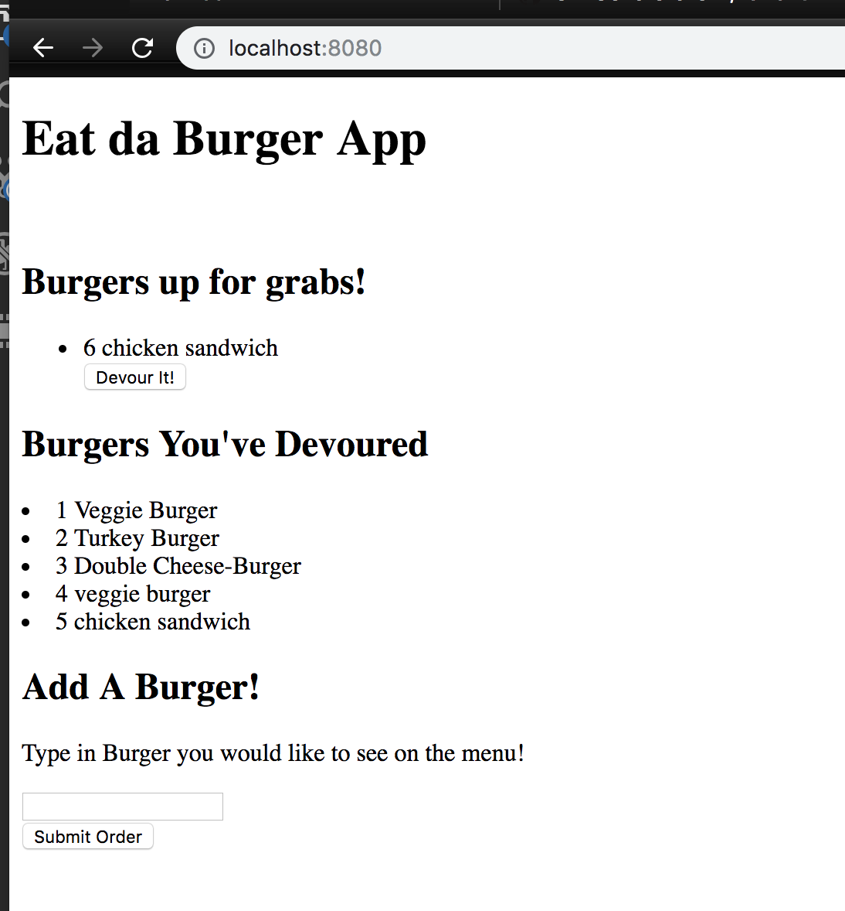
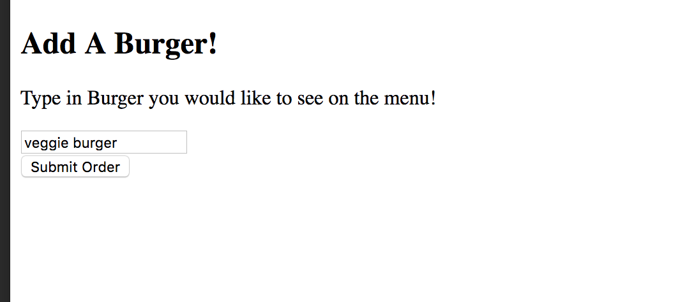
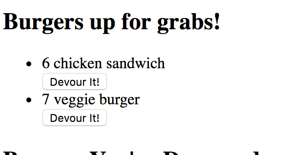

## Eat Da Burger Application
- The Eat da Burger is a node application that allows you to add burgers to the database then devour those burgers by clicking a button.

## Dependencies required
- The application requires a number of dependencies which are , MYSQL, method-override, body-parse, express-handlebars, and express.
- To Install MYSQL you must make sure you are in your root folder and then type in npm i mysql ; this will install the dependency to your folder
- To Install method-override you must make sure you are in your root folder and then type in npm i method-override ; this will install the dependency to your folder
- To Install body-parse you must make sure you are in your root folder and then type in npm i body-parse ; this will install the dependency to your folder
- To Install express-handlebars you must make sure you are in your root folder and then type in npm i express-handlebars ; this will install the dependency to your folder
- To Install express you must make sure you are in your root folder and then type in npm i express ; this will install the dependency to your folder

## Running the Application
- Once all required dependencies are installed you are ready to run the eat da burger application

- Start by going to your root folder in the terminal, once this is done you type in node or nodemon server.js to run the server.

- 
If you have received they above screen that means your server is connected and running. 

- 
You then go to your localhost port to see the web page. Which in this case is localhost:8080. Once you type in localhost:8080 in your browser it will take you to the above page where the application is located.

-
To Add a burger to your database and screen, you go to the text box and type in a burger like the above picture and clicking submit. When submit is clicked the burger that you typed in will add to the database and then to the body of the HTML

-
The Above picture shows when the burger has been successfully added to your database and the html.

-

-
The application shows when the burger has been devoured and moves it to the designated area in the HTML. By hitting the devoured button your burger moves into the devoured section of the html and updates your database.

